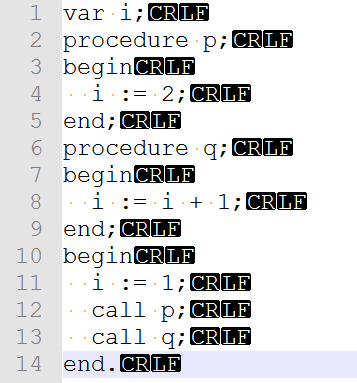
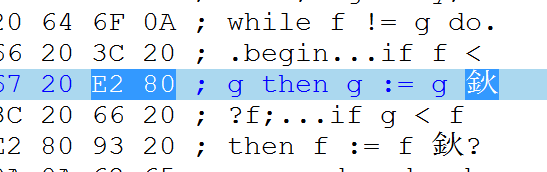

## 完成任务情况

本人(PB16020923)进行了总体构思和任务分配。

- `PL0Lex_get_token`函数每次被调用时，顺序读入文件中的字符，直到得到一个token或着发现语法错误
- 该函数由本人完成，实现了一个有限自动机，一开始进入`START`状态，然后进入while循环，每次读入一个字符后根据状态转换表进行转换。如果进入非接受状态，则循环继续，但要注意对数字和标识符以及长度进行记录，以便后续返回。如果当前的状态是`IN_LINECOMMENTS`则忽略一切字符直到读取到换行符`\n`。如果当前的状态是`IN_BLOCKCOMMENTS`则忽略一切字符直到读取到`*/`。如果进入了接受状态则返回token及其类型，长度，行号，位置。

- 为了使状态表不会太大，对每次读取的字符进行分类，则可根据当前状态和当前输入的字符类型进行转换。除了数字类型，字母类型，3种分隔符类型外，长度为1的symbol字符每种对应一个类型，以及长度为2的symbol中出现的额外字符`!`和`:`也作为两种类型，其他字符均视为非法字符类型。字符类型表由赵敏帆同学(PB16051448)完成。

- 重点是构造转换表，本人的基本思路如下，具体由魏天一同学(PB16001732)完成。
  - 起始处于`START`状态，若读取的字符类型为`ILLEGAL`，直接返回错误类型。
  - 如果读取到数字，则进入`IN_NUM`状态，继续读到数字则保持该状态，读到其他类型字符则进入`NUM_AC`状态。
  - 如果读取到字母，则进入`IN_ID`状态，继续读到数字，字母和下划线则保持该状态，读到其他类型字符则进入`ID_AC`状态。
  - 对于长度为2的symbol
    - 对于各比较运算符`<=`和`>=`，读到第一个字母时，进入一个选择状态，根据下一个字符是否为`=`来进入相应接受状态，注意是否回退一个字符。
    - 对于`!=`和`:=`，读取第一个字符时，分别进入选择状态，如果下一个字符是`=`，则接受，否则，第一个字符是非法字符，报错。
  - 对于剩下各个长度为1的symbol，读到该字符就进入对应symbol的接受状态
  - 对于注释，读取到`/`，进入一个选择状态，如果下一个字符是`*`则进入注释状态，否则接受`/`。退出注释状态同理。
- 关于是否回退一个字符，预先设置一个数组来查询。
- 关于保留字，不在状态表中体现，进入`ID_AC`后取得一个字符串，此时才与保留字数组进行比较，如果不属于其中任何一个，则认为是标识符。

## 遇到问题

#### 问题描述

每次读取到行末时会触发`assert(lex->last_token_type != TOKEN_NULL);`

提示了

```
test: /home/lin/pl0/pl0compiler/test.c:39: main: Assertion 'lex->last_token_type != TOKEN_NULL' failed.
Aborted (core dumped)
```

#### 具体细节

之前认为ubuntu中换行只有`\n`，所以在chartype中是将`\r`视为非法字符的（因此返回`TOKEN_NULL`，触发assert），只认为`\n`是换行，但测试文件似乎既有`\n`也有`\r`



#### 解决方法概述

一开始通过修改`chartype`数组，将`\r`也映射为newline类型

后来询问助教后，`\r`是在Windows中编辑不小心引入的，之后测试文件更新了，不再有`\r`

所以，我又改回去了，`\r`视为非法字符

#### 经验教训

我也很无奈

----

#### 问题描述

相邻两行的行号相差为2，出现行号增加两次

#### 具体细节

这种情况出现在标识符是该行的最后一个Token且标识符之后就是换行符，这样，在标识符结束时会有一个回退一个字符的动作，导致`\n`被扫描两次，则行号也被增加了两次。

#### 解决方案概述

为了避免回退导致`\n`出现两次，应该限制`\n`扫描后是在`START`状态下，也是不回退的情况下，判断此行结束，所以判断条件改为`if(ch=='\n' && state==START)`

#### 经验教训

注重细节

------

#### 问题描述

块注释涉及多行时，行号不递增

#### 具体细节

块注释被认为在同一行

#### 解决方案概述

上面的问题在解决时限制了状态在`START`时才递增行号，遗漏了块注释的情况，应该改为`if(ch=='\n' && (state==START || state==IN_BLOCKCOMMENTS))`

#### 经验教训

牵一发而动全身

-----

#### 问题描述

标识符识别有问题，长度为1的标识符不被识别，长度大于1的标识符第一个字符不被识别。

#### 具体细节

标识符前面是delim的情况下，读取了标识符第一个字符，从`IN_DELIM`到`START`状态后，应该回退一个字符，表示delim结束，但是并非所有跳转到START状态的情况都要回退一个字符，这样处理很麻烦。

#### 解决方案概述

经考虑，`IN_DELIM`状态可以省去，任何情况下读取到delim就跳转到`START`状态，这样不用退格

#### 经验教训

要仔细，避免状态多余

-----

#### 问题描述

测试test.pl文件是，扫描到22行`if f < g then g := g �C f;`的`-`时出现`Segmentation fault (core dumped)`

#### 具体细节

使用gdb调试，提示

```
Program received signal SIGSEGV, Segmentation fault.
0x08048f45 in PL0Lex_get_token (lex=0x804c180) at /home/lin/pl0/pl0compiler/lex/pl0_lex.c:90
90			state=statetable[chartype][state];//state translate
```

#### 解决方法概述

经查，测试文件test.pl的第22行的`-`是全角字符。。



遂在google group中询问助教

后来，测试文件更新了。。

#### 经验教训

不知道说什么好了=  =


