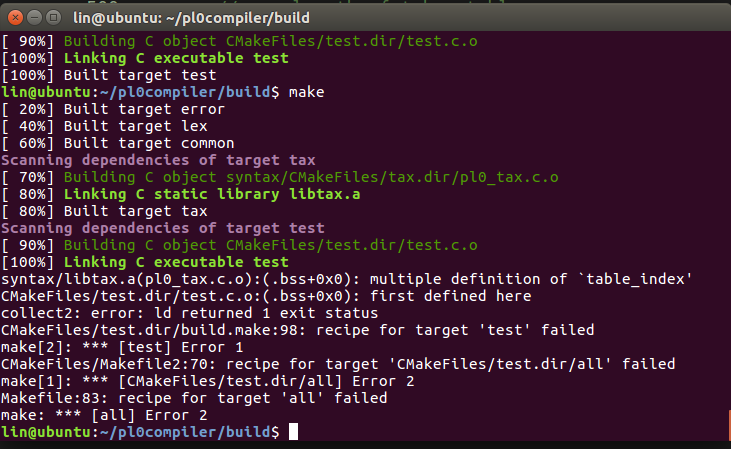
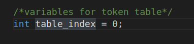

## 完成任务情况

- 完成语法分析中的错误处理，能够分析test_err.pl中的所有错误，不因检测出一个错误而停止

- 拓展功能
  - 增加逻辑运算符 && || !  ，将PL/0语言中的“条件”概念一般化 (表达式值非零即为“真”)
  - 加入return语句
  - 增加else/elif
  - 增加do while 
  - 增加参数传递
  - 在语法分析中引入负数
- [语法图](./extend-pl0 - 2.pdf)
- 本人完成的部分
  - 在词法分析中增加相关关键字
  - 设计及绘制语法图
  - 在lab2基础上，根据新的语法图，修改了term, factor 函数，删除了condition, expression, 重新实现了arithmetic_expression, relation_expression, and_expression, or_expression.

## 遇到问题

#### 问题描述

打印错误所在行的文本

#### 具体细节

本次实验需要打印错误所在行的文本，而之前词法分析时是每次用`fgetc`读取一个字符，并没有保存当前行

#### 解决问题概述

修改读取方式，一开始用`fgets`读取一行，缓存至`linebuf`中，每次用`pos`偏移获取一个字符放在全局变量`ch`中，如果`ch==0`，即读取到`linebuf`结束时，再使用`fgets`读取一行。

`linebuf`定义在在`lex`结构体中，语法分析时调用错误函数时可以使用。

#### 经验教训

无

-----

#### 问题描述

gcc提示错误

#### 具体细节

#### 解决问题概述

table_index重复定义的原因是，在pl0_tax.h就已赋值，而之后有多处Include了pl0_tax.h

应该去除在.h文件中的初始赋值，到.c文件中赋值

#### 经验教训

无

-----

#### 问题描述

遇到某个错误时，反复报同一个错

#### 具体细节

遇到某个错误时，反复报同一个错

#### 解决问题概述

错误处理时忘记再次`gettoken`

#### 经验教训

要仔细

---

#### 问题描述

分析错误文件到文件结束时，文件末尾多报了很多错。

#### 具体细节

分析错误文件到文件结束时，文件末尾多报了很多错。（当时忘记截图了，很多不相关的错）

#### 解决问题概述

某个非终结符的follow集写错了。。

#### 经验教训

要仔细
